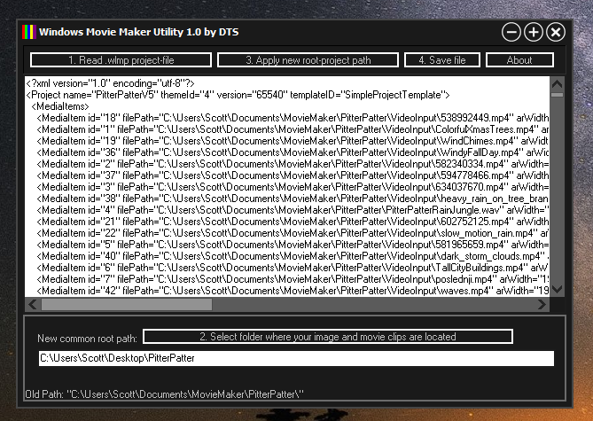

# windows-movie-maker-utility
Repairs broken Windows Movie Maker project files (wlmp) if you've moved associated movie clips and images

This project builds with the free version of Embarcadero RAD Studio C++ Builder 10.2 (Tokyo).

First drag-drop your Windows Movie Maker project file, then drag-drop the root folder where your source movie clips and images are stored. Apply the changes and save the new file.

Use at your own risk (the usual...)

Contact: dxzl@live.com

